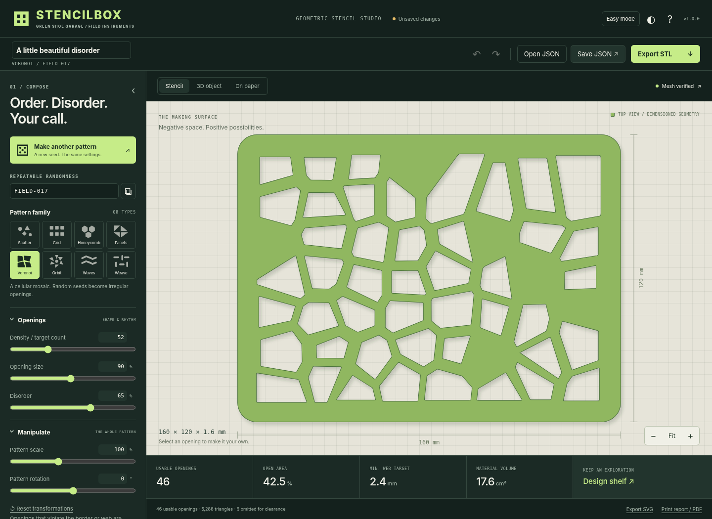
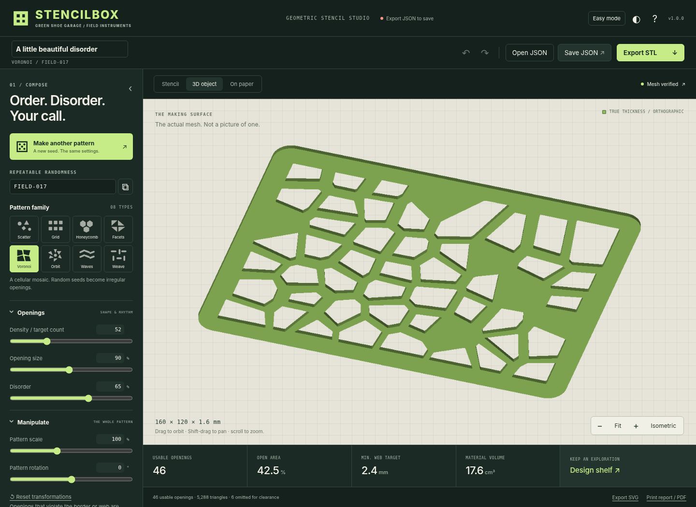
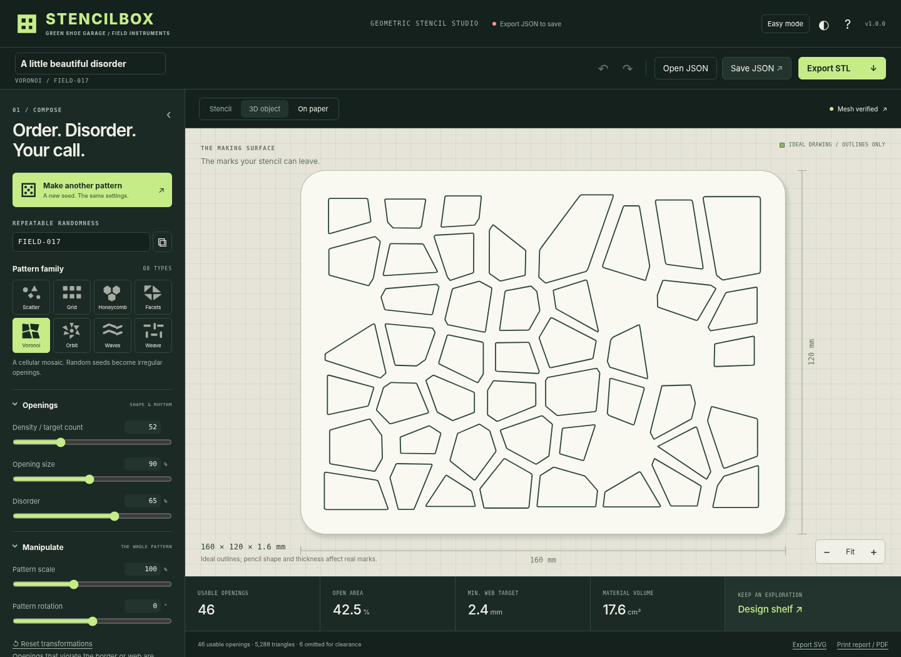

# STENCILBOX · v1.0.0

### Make the pattern. Print the tool. Leave a mark.

A small, local-first geometric stencil studio from **Green Shoe Garage / Field Instruments**. Generate random geometric openings, manipulate the composition, inspect a connected stencil, and export a real STL for slicing and 3D printing. Save the complete editable project as JSON to keep or share it.



**[Run & deploy](docs/DEPLOYMENT.md) · [Developer guide](docs/DEVELOPMENT.md) · [Validation](docs/TESTING.md) · [Contributing](CONTRIBUTING.md)**

## GitHub-ready repository

The app is already built. Keep this folder's contents at the repository root, including the hidden `.github/` directory. Create an empty repository named `stencilbox`, commit these files to `main`, and push. [Exact setup commands and hosting instructions](docs/DEPLOYMENT.md) are included.

CI checks the app and test suites on pushes and pull requests. Optional **Deploy GitHub Pages** runs manually after enabling Pages with **Source: GitHub Actions**; it publishes only the app and license notices, after tests pass. Automatic Pages deployment is an opt-in documented in the workflow.

This release updates app branding, repository metadata, export labels, examples, and screenshots. The geometry algorithm and generator version remain **1.0.0**, so existing designs regenerate without changing their contours. It is a rebrand, not a new generator release. See [rename and compatibility notes](docs/RENAMING.md).

## Start here

Unzip the package and open **`index.html`** in a modern desktop browser. It is the complete application: styles, JavaScript, triangulation engine, and 3D renderer are embedded. There are no runtime dependencies, external fonts, CDNs, accounts, telemetry, network calls, package-install steps, or compilation requirements.

Choose a pattern family, then press **Make another pattern**. Adjust the opening size, overall scale, rotation, board dimensions, thickness, border, and minimum connecting web. The main canvas always shows the resulting usable openings, not an unchecked idealization. Select an opening in Stencil view to edit it individually.

Use **Export STL** to create a binary STL, **Save JSON** to preserve the editable project, and **Open JSON** (or drag a file onto the page) to restore a project. Eight ready-to-open studies, each with STL, JSON, and SVG files, are in `examples/`.

### Hosting

Only **`index.html`** needs to be uploaded to your static site. For a route such as `/stencilbox/`, place it at:

```text
stencilbox/
└── index.html
```

The other folders are documentation, examples, tests, and editable source; the running app does not load them. No root-relative asset paths or server routes are required. The same file is the portable/offline edition; it is not necessary to keep the whole ZIP together to run it.

Local browser storage is specific to the browser, profile, and origin or file location. Moving the HTML file, switching browsers, clearing site data, private browsing, or browser policy may change or disable persistence. The app reports save failures. **Export JSON for durable backups and sharing.** Offline use means opening the downloaded HTML, not assuming a hosted page remains cached indefinitely. There is no service worker.

## What is included

| Area | Capabilities |
| --- | --- |
| Pattern families | Scatter, grid, honeycomb, triangular facets, Voronoi cells, radial orbit, wave slots, and weave slots. |
| Opening shapes | Mixed geometry, circles, triangles, squares, diamonds, hexagons, stars, and rounded slots in families that support variable motifs. |
| Composition | Reproducible random seed, density/target count, opening size, disorder, size variation, and corner softening. |
| Transformations | Overall scale and rotation; independent opening rotation; X/Y stretch, shear, X/Y translation, and mirrors. |
| Individual editing | Select, drag, edit center coordinates, rotate, scale, reset an edit, and hide an opening. Unsafe edits are rejected. |
| Physical model | Rounded rectangle, rectangle, oval/circle, or hexagon; width, height, thickness, solid border, and minimum connecting web. All model dimensions are millimeters. |
| Views | Stencil, actual triangle-mesh 3D object with orbit/pan/zoom, and ideal drawing outlines on paper. |
| Exports | Binary STL, versioned editable JSON with geometry snapshot and findings, millimeter-sized SVG, and a printable inspection report suitable for Save as PDF. |
| Project workflow | Autosave indicator, undo/redo, local design shelf, comparison baseline, project notes, Clear Openings, and Fresh Start. |
| Accessibility | Easy/Advanced modes, dark/light/high-contrast themes, labeled controls, keyboard shortcuts, collapsible controls, mobile layout, reduced-motion support. |

### Three kinds of scale

**Opening size** scales every opening around its own center; the centers remain in place. **Pattern scale** scales opening positions and geometry around the plate center without changing the plate. **Board width/height** changes the actual physical stencil and regenerates its layout. Individual opening scale is a fourth, local edit available in the inspector.

Changing the seed or pattern family clears individual edits to avoid applying an old opening ID to a different design. Undo restores the previous recipe and edits. Other generator changes are deterministic and retain ID-based edits, but can change which openings fit.

The density value is a target, not a promise: some regular arrangements produce a nearby count, and unsuitable openings are omitted. Scatter uses a bounded packing search. The visible **usable opening count** is authoritative. In Advanced mode, **Show omitted** draws excluded candidates as dashed outlines; they are not included in the STL.

## An actual stencil, not disconnected geometry

Every accepted opening is a simple polygon fully inside a convex plate outline. Openings remain separated by the requested minimum web, and the outside border stays intact. This preserves one connected body without floating islands. Overlapping cutouts are not unioned or silently allowed to consume the material between them.

Global transformations can make openings unsuitable. The generator omits those candidates and reports the effect. Individual edits are refused when they would invalidate an existing opening or its clearance. Hiding an opening removes a cutout: that region becomes solid material, not a loose printed part.

The mesh is a flat, constant-thickness extrusion with its bottom at **Z = 0**. Curves use polygonal approximations. Top and bottom faces are triangulated; boundary walls are added with matching winding. Coordinates are converted to binary STL's float precision **before** triangulation and validation. A conforming-mesh pass resolves applicable collinear T-junctions.

Export requires paired edges, consistent edge direction, no degenerate triangles, one connected component, positive volume, the expected volume within numerical tolerance, and the correct Euler characteristic for the opening count. Failure blocks STL export rather than offering an unchecked file.

These are geometry checks, **not physical printability or strength certification**. Thin-web, layer-count, print-bed, and drawing-tip warnings are heuristics based on editable assumptions. The reported tip check is a bounding-box screen, not a full pencil-clearance simulation; sharp corners may be inaccessible even when no warning is raised.

## 3D and drawing views



The 3D viewer renders the same vertices and faces used in STL output, at the actual modeled thickness. It first attempts WebGL and falls back to a CPU depth-buffered Canvas renderer when WebGL is unavailable. The fallback is a genuine 3D triangle rasterizer, not a substituted flat picture. High-density patterns can take longer to render in software.

Drag to orbit, Shift-drag or middle-drag to pan, and scroll or use the zoom buttons. **Fit** recenters the camera; **Isometric** also restores the initial angle. In 2D views, Shift-drag or middle-drag pans the view.



**On paper** shows ideal geometric outline marks. Actual marks depend on the pencil or pen, its angle, stencil thickness, and tracing technique. Neither the display nor the printed report is guaranteed to appear at physical 1:1 scale. SVG files explicitly specify millimeter dimensions; check the print or vector application's scaling and measure a known dimension.

## Export, save, share

### STL

Open the exported STL in your slicer and interpret its coordinates as **millimeters**. STL does not define an authoritative unit declaration. The filename and 80-byte header do not override a slicer's unit interpretation. Check the dimensions and sliced layers before printing. Export does not produce G-code or select a printer, filament, adhesion method, support setting, or slicer profile.

### JSON

A project contains `format`, `schemaVersion`, `generatorVersion`, `units`, `settings`, `edits`, and the generated outer/opening contours. App exports also include a timestamped check snapshot and optional baseline summary. Notes are part of `settings`.

Import accepts schema 1 projects for generator 1.0.0. The recipe is regenerated and, when a geometry snapshot is supplied, checked for an exact contour match. Incorrect units, incompatible generator versions, malformed edits, or mismatched snapshots are rejected without replacing the current project. A project from a different generator release should be opened with that matching release rather than silently reinterpreted.

Share the JSON file with another person who has STENCILBOX. Both current STENCILBOX and legacy TRACEFORM v1.0.0 JSON projects can be imported; new exports use `stencilbox-project`. The original TRACEFORM app does not understand the new format name. There is no cloud-sharing service. Their import recreates the same seed, parameters, edits, and opening contours. Exported STL coordinates have the normal float rounding described above.

### Report and SVG

The report lists the recipe, dimensions, geometric findings, confidence levels, print assumptions, baseline comparison, and project notes. **Print report / PDF** invokes the browser's print flow; PDF creation depends on the browser/operating system offering Save as PDF. The report illustration is fitted to the page, not actual size.

SVG exports the outer boundary and opening boundaries; from **On paper**, it exports the ideal drawing outlines instead. SVG is an additional 2D interchange format, not a substitute for the STL's 3D thickness.

## Keyboard shortcuts

| Key | Action |
| --- | --- |
| R | New random seed, preserving settings |
| 1 / 2 / 3 | Stencil / 3D / On paper |
| 0 | Fit the current view |
| Arrow keys with an opening selected | Move by 0.5 mm; Shift changes the step to 2 mm |
| Delete / Backspace | Hide the selected opening |
| Escape | Clear selection and close the checks panel |
| Ctrl/Cmd S | Export JSON |
| Ctrl/Cmd Z | Undo outside text inputs |
| Ctrl/Cmd Shift Z | Redo outside text inputs |

## Validation and known boundaries

The latest packaging verification is in **[docs/REPOSITORY_VALIDATION.md](docs/REPOSITORY_VALIDATION.md)**. See **[docs/TESTING.md](docs/TESTING.md)** for the reproducible tests, recorded results, and explicit limits of the environment used for testing. In this release, 224 geometry cases and 44 browser integration checks pass, and eight sample binary STLs pass independent Trimesh and Shapely inspection.

The browser test environment forbids URL navigation, so integration testing loaded the actual embedded HTML directly into the DOM. Native file-origin persistence, a hosted navigation, native download dialogs, Safari/Firefox, the WebGL renderer, slicer imports, and physical prints have **not** been validated here. Persistence logic was tested with a storage adapter, export payloads with a Blob interceptor, and interactive 3D with the software renderer. This distinction is recorded in the test report, not hidden behind a blanket compatibility claim.

This release does not include arbitrary polygon/image import, combined boolean cutouts, automated island bridges for imported art, bevels, pencil-tip collision simulation, G-code, printer integration, built-in cloud sharing, or multi-layer registered stencils. It is a geometric stencil instrument rather than a general CAD system.

## Project layout

```text
stencilbox/
├── index.html                 Complete portable/static application
├── README.md                  User guide with screenshots
├── VERSION                    1.0.0
├── LICENSE                    MIT license for STENCILBOX
├── THIRD_PARTY_NOTICES.md      Vendor attribution and provenance
├── CONTRIBUTING.md            Contribution and compatibility rules
├── SECURITY.md                Privacy and reporting guidance
├── build.py                   Optional packer and --check verification
├── package.json               Dependency-free npm test convenience
├── requirements-dev.txt       Developer-only verification tools
├── .github/
│   ├── workflows/ci.yml       Automated verification
│   ├── workflows/pages.yml    Optional tested Pages deployment
│   ├── ISSUE_TEMPLATE/        Bug and feature forms
│   ├── pull_request_template.md
│   └── dependabot.yml
├── src/                       Editable HTML, CSS, JavaScript
├── vendor/                    Bundled triangulator and ISC license
├── examples/                  Eight JSON + STL + SVG studies
├── docs/                      Screenshots and documentation
├── tests/                     Regression scripts and release evidence
└── tools/                     Repository checks and ZIP packager
```

### Developer commands

The application itself needs none of these developer tools. Node.js 22 and Python 3.13 are the configured CI runtimes.

```sh
python3 build.py --check
python3 tools/check_repo.py
node tests/geometry.test.js
node tests/rename.test.js

# After editing src/, regenerate and commit index.html
python3 build.py

# Optional independent STL and browser verification
python3 -m pip install -r requirements-dev.txt
python3 tests/validate_stl.py
python3 -m playwright install chromium
python3 tests/browser.test.py
python3 tests/rename.test.py

# Produce a fresh repository ZIP and standalone HTML
python3 tools/package_release.py
```

Fresh test outputs go into ignored `artifacts/`; reviewed examples, screenshots, and historical results are not overwritten by ordinary test runs. Full setup, virtual environment instructions, output controls, and CI behavior are in the [developer guide](docs/DEVELOPMENT.md).

## License and attribution

STENCILBOX source is provided under the MIT license. Mapbox Earcut retains its ISC license and attribution. The app bundles the isolated triangulation module; it does not bundle Plotly. See `THIRD_PARTY_NOTICES.md` and `vendor/EARCUT-LICENSE.txt`.
